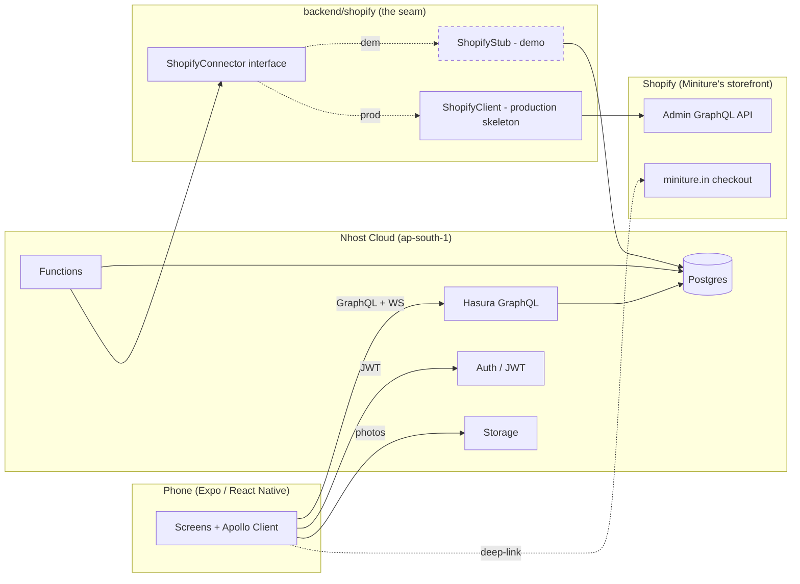

# Miniture Buyback

A buyback / circular-economy feature for [Miniture](https://miniture.in) — the missing seller loop that lets parents return outgrown Montessori products for store credit, trade-in credit, or NGO donation. Built as a pitch demo for an internship at Miniture.

## TL;DR

- Miniture markets products as "lasts 15 years," but most kids only need them for ~5. The buyback feature turns that unused life into a second sale, a loyalty hook, or a donation.
- Three paths — **Refurb**, **Trade-in**, **Donate** — each tuned to a different parent segment (multi-kid, aged-out, or cash-equivalent seekers).
- Built as an *extension*, not a replacement: a clean `ShopifyConnector` boundary integrates with Miniture's existing Shopify storefront. One config flag flips the demo to production.
- Same checkout, same cart, same brand. The Renewed listings live on `miniture.in`.

## The pitch

Miniture's brand promise — "lasts 15 years" — is also a problem: parents have working products their kids have outgrown, and no easy way to return value to themselves or to Miniture. This feature closes that loop. Parents pick one of three paths based on what they want: **store credit** (refurb), **bonus-locked credit for the next purchase** (trade-in), or **a donation to an NGO partner with an impact certificate** (donate). The architectural play is integration, not replacement: the buyback workflow lives in a new Nhost-backed service, but every Shopify-touching write goes through a single connector that's stubbed for the demo and production-ready in skeleton — `backend/shopify/ShopifyClient.ts` ships with the real Admin API GraphQL operations already filled in.

## Demo

Full minute-by-minute walkthrough: [`docs/demo-script.md`](docs/demo-script.md).

```bash
# Backend: already deployed to Nhost cloud (subdomain ntytiuebfzzodrotraun, region ap-south-1).
# Endpoints in docs/cloud-config.md.

# App
cd app
npm install
npx expo start
# Scan QR with Expo Go (iOS) or Android device on the same Wi-Fi.

# Demo accounts
# josh.parent@miniture.demo / Demo1234   — multi-kid family (refurb / trade-in path)
# maya.mom@miniture.demo   / Demo1234    — aged-out family (donate path)
# ops@miniture.demo        / Demo1234    — admin dashboard
```

## Architecture

Full diagrams + decision record: [`docs/architecture.md`](docs/architecture.md). What's stubbed vs. what's real: [`docs/whats-faked.md`](docs/whats-faked.md).



The dashed line is the only thing that changes between demo and production. The `CONNECTOR_MODE` env flag in `backend/shopify/index.ts` selects which implementation `getShopifyConnector()` returns. App, Hasura, Functions, and the rest of the stack do not know or care.

## Project layout

```
.
├── app/                          # Expo / React Native client (SDK 54, Expo Router)
│   ├── app/                      # File-based routes
│   │   ├── (auth)/               # Sign in / sign up
│   │   ├── (tabs)/               # Home / Shop / Profile / Activities / Playlist
│   │   ├── (admin)/              # Ops QC dashboard (role-gated)
│   │   ├── my-products/          # Owned units list
│   │   ├── return/               # 4-step return flow (photos, grade, path, pickup)
│   │   └── credit/               # Ledger + transfer screens
│   ├── components/               # Pastel cards, segmented controls, tag pills
│   ├── constants/theme.ts        # Palette, Spacing, Radius, Typography (single source of truth)
│   ├── graphql/operations/       # Typed queries / mutations / subscriptions
│   ├── lib/{nhost,apollo}.ts     # Cloud wiring
│   └── providers/                # Auth + Apollo at root
├── backend/
│   └── shopify/                  # The integration boundary
│       ├── ShopifyConnector.ts   # Interface — the contract
│       ├── ShopifyStub.ts        # Demo impl (writes to shopify_stub_* tables)
│       ├── ShopifyClient.ts      # Production skeleton — real Admin GraphQL queries
│       ├── types.ts              # Shopify-shaped types (GIDs, Money, etc.)
│       ├── index.ts              # Factory — flips on CONNECTOR_MODE
│       └── README.md             # Why this is the only file Shopify lives in
├── nhost/
│   ├── migrations/default/       # SQL DDL (21 tables, 38 FKs)
│   ├── metadata/                 # Hasura table tracking, relationships, permissions
│   ├── seeds/default/            # Demo data (15 real products, 3 accounts, 3 NGOs)
│   └── nhost.toml                # Cloud project config
├── functions/                    # Nhost Functions (submitReturnRequest, approveQC, ...)
│   └── _lib/                     # Shared helpers
├── scripts/                      # Cloud apply / smoke test scripts
├── docs/
│   ├── data-model.md             # Tables, semantics, state machine, RLS
│   ├── er-diagram.md             # Mermaid ER + state diagrams
│   ├── cloud-config.md           # Endpoints, admin secret, migration workflow
│   ├── architecture.md           # Demo vs production diagrams, request flow, decisions
│   ├── demo-script.md            # 5–7 min walkthrough, click-by-click
│   ├── whats-faked.md            # Stubbed-vs-real matrix with production wiring
│   └── pitch-narrative.md        # Strategic story (the "why" of every choice)
└── AGENT_CONTEXT.md              # Build context for parallel agents
```

## Tech stack

| Layer | Choice | Why |
|---|---|---|
| Backend platform | **Nhost cloud** | Postgres + Hasura + Auth + Storage + Functions in one project. Nothing to host. |
| API | **Hasura GraphQL** (HTTP + WS) | Permissions live with the schema. Subscriptions over WS power the live "credit added" moment. |
| Auth | **Nhost Auth (JWT)** | Email/password + JWT claims that map directly to Hasura roles (`parent`, `ops`, `admin`). |
| Client | **Expo SDK 54 / React Native 0.81 / Expo Router** | File-based routing, native build path when ready, single codebase iOS+Android. |
| Data layer | **Apollo Client** | First-class subscriptions, normalized cache, codegen-friendly. |
| Shopify | **`ShopifyConnector` boundary** | Stub for demo, production-ready skeleton with real Admin GraphQL 2026-01 queries. |
| Storage | **Nhost Storage** | Photos for QC. Signed URLs gated by JWT. |

## Status

**Done**

- Data model: 21 tables + 2 views, 38 FK relationships. Cloud-applied. See [`docs/data-model.md`](docs/data-model.md).
- Demo data: 15 real Miniture products, 3 NGO partners, 3 demo accounts (Josh's Parent, Maya's Mom, Ops Admin), seeded orders + owned units.
- Shopify connector: interface, faithful stub, production skeleton with real GraphQL queries in `backend/shopify/ShopifyClient.ts`.
- App scaffolding: theme tokens matched to Miniture's design language, 5-tab navigation, Auth + Apollo providers wired.

**Pitched but stubbed (deliberate)**

Full matrix in [`docs/whats-faked.md`](docs/whats-faked.md). Highlights:

- Real Shopify Admin API calls — one factory line away (`backend/shopify/index.ts`).
- Reverse-logistics pickup — fake QR for the demo, Shiprocket/Delhivery integration is ~2 days of work.
- NGO-side updates — admin button in the demo, real partner integration is per-NGO and would take 1–2 weeks each.
- Push notifications — in-app banners only; FCM wiring is a day.

These aren't oversights. They're a pitch saying *"the software is the easy part — here's the real shape, and here's exactly what you'd invest in next."*

## Author

Deepan — built this as an internship pitch for Miniture, May 2026.
