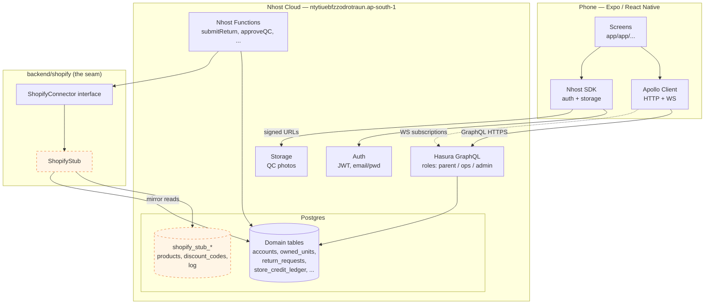
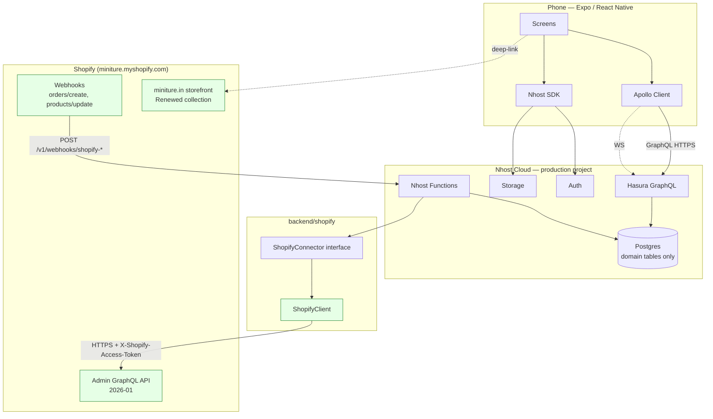
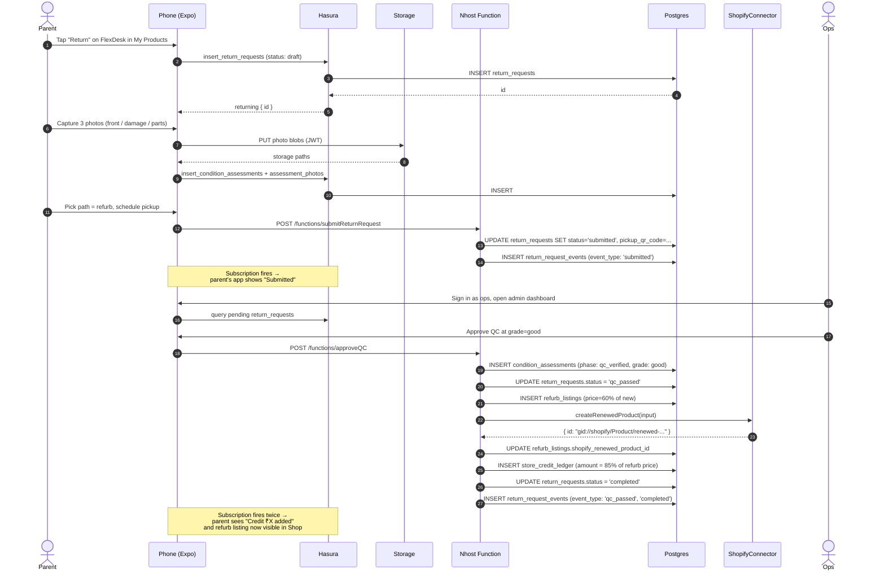

# Architecture

Three diagrams, each followed by what's in the boxes and why it's drawn that way. A decision record at the bottom records the architectural choices that mattered most.

## 1. Demo architecture

This is what's running today. One Nhost cloud project, one phone, one stubbed Shopify.



**What's in the boxes.** The phone runs an Expo SDK 54 app. Apollo handles GraphQL over HTTPS for queries/mutations and over WebSocket for subscriptions — the live "credit added" moment depends on this. Nhost Cloud is one managed project bundling Postgres, Hasura, Auth, Storage, and Node-runtime Functions. Hasura's permission system enforces row-level security per role, so the parent never sees another parent's data even though everything sits in one Postgres.

**The connector seam.** `backend/shopify/index.ts` exports `getShopifyConnector()`. In demo mode (`CONNECTOR_MODE=stub`) it returns `ShopifyStub`, which writes to `shopify_stub_products`, `shopify_stub_discount_codes`, and `shopify_stub_log` (the last one is what powers the admin dashboard's "watch the integration fire" view). The stub returns Shopify-shaped objects — string GIDs like `gid://shopify/Product/...`, Money objects with currency codes — so the calling code never knows it's faked.

**Why the stub tables live in the same Postgres as the domain tables.** Pure convenience for the demo. They're prefixed `shopify_stub_*` and isolated by the connector boundary, so when production swaps to `ShopifyClient` the stub tables become unused (and would be dropped in a cleanup migration). Keeping them in Postgres means we can show the reviewer the exact mutation payload that *would* hit Shopify — it's a row in `shopify_stub_log`. That observability disappears in production, which is the right tradeoff: you want one source of truth (Shopify) once it's real.

**Files to drill into.** `app/lib/apollo.ts`, `app/lib/nhost.ts`, `nhost/migrations/default/1715000000000_initial_schema/`, `nhost/migrations/default/1715000001000_shopify_stub/`, `backend/shopify/ShopifyStub.ts`.

## 2. Production architecture

Same phone. Same Apollo. Same Hasura. Same Functions. The connector now points at real Shopify Admin API. The `shopify_stub_*` tables are gone.



**What changed.** Three things, marked in green:

1. `ShopifyClient` replaces `ShopifyStub` as the connector implementation. The class already exists at `backend/shopify/ShopifyClient.ts` with the real GraphQL operations (`productCreate`, `discountCodeBasicCreate`, `customer.orders` connection, etc.) filled in — only the `fetch` block in the `graphql()` helper is commented out. Uncomment, set env vars, redeploy. The `ShopifyConnector` interface is unchanged, so every Function calling `getShopifyConnector().createRenewedProduct(...)` keeps working.
2. Inbound webhooks from Shopify for order creation and product updates land at Nhost Function endpoints, which write to the same domain tables (`orders`, `owned_units`, `refurb_listings`) the demo seeds today. The receive path doesn't go through the connector — it doesn't need to. The connector exists for *outbound* writes where we need the demo/production swap.
3. The Renewed collection on `miniture.in` becomes the real selling surface. The app deep-links to it for checkout — we never proxy checkout through our backend. Same cart, same payment, same brand trust.

**What didn't change.** The phone code. The Apollo wiring. The Hasura schema (minus the stub tables). The Functions. The connector interface. This is the architectural payoff: production-readiness without an app rewrite.

**Activation.** From `backend/shopify/README.md`:

```bash
CONNECTOR_MODE=production
SHOPIFY_SHOP_DOMAIN=miniture.myshopify.com
SHOPIFY_ADMIN_ACCESS_TOKEN=shpat_...
SHOPIFY_RENEWED_COLLECTION_GID=gid://shopify/Collection/123456
```

Plus uncommenting the `fetch` block in `ShopifyClient.graphql()`. That's the diff.

**Files to drill into.** `backend/shopify/ShopifyClient.ts`, `backend/shopify/index.ts`, `backend/shopify/README.md`.

## 3. Return request flow (sequence)

The end-to-end happy path for a refurb return. Trade-in is identical except the credit row has `expires_at` and `source_type = 'trade_in_payout'` with a 25% bonus. Donate diverges at the QC step.



**What flows through the arrows.** The parent's actions on the phone are GraphQL mutations into Hasura, which apply RLS per the `parent` role and write to Postgres. Photo uploads bypass GraphQL — they go straight to Nhost Storage with the user's JWT — and the resulting storage paths are then recorded in `assessment_photos` via Hasura. Long-running orchestration (submit, approve QC) goes through Nhost Functions, not raw Hasura mutations, because they need to do multiple coordinated writes plus the connector call inside one logical operation.

**Why the connector call sits inside the Function, not triggered from Hasura.** Two reasons. First, the connector returns a Shopify GID we need to write back into `refurb_listings.shopify_renewed_product_id` — it's a coordinated write, not a fire-and-forget. Second, error handling: if Shopify rejects the product create, we want to mark the return as `qc_passed` but not `completed`, and surface the error in `return_request_events` for ops to investigate. Postgres triggers can't do that cleanly.

**The live moment, mechanically.** When `approveQC` finishes, the parent's app has an active subscription on `return_requests(account_id: $me)` and on `store_credit_ledger(account_id: $me)`. Hasura pushes the new rows over the WS connection. The parent's screen updates without a refresh. This is the wow moment in the demo, and it's just standard Hasura subscriptions — no extra infrastructure.

**Files to drill into.** `functions/submitReturnRequest/`, `functions/approveQC/`, `app/graphql/operations/` (subscriptions), `app/components/StatusTimeline.tsx`.

## Decision record

The choices that mattered, with their alternatives.

### Why Nhost cloud, not self-hosted Hasura + Postgres + Auth0

A pitch demo has one job: be ready to show, on demand, without 30 minutes of `docker compose up` failures. Nhost bundles Postgres + Hasura + Auth + Storage + Functions into one managed project with one set of endpoints. We get JWT-claims-to-Hasura-roles wiring for free, signed-URL storage for free, and we can push migrations and metadata via the admin API without standing up CI. The same architecture is production-grade — Nhost's pricing scales with usage and it's the same Hasura/Postgres a self-hosted setup would use. If Miniture wanted to migrate off Nhost later, the migration is moving Postgres + reapplying Hasura metadata, which is an afternoon.

The alternative was self-hosting Hasura on a VPS with Auth0 / Supabase Auth / custom JWT. That's two extra services to keep alive during a demo, two extra failure modes, and zero added value for the pitch.

### Why Apollo Client, not urql or Relay

Subscriptions are load-bearing for the demo's wow moment (the parent's phone updating live when ops approves QC). Apollo's WS subscription support is the most mature in the React Native world, the cache normalization is well understood, and the codegen ecosystem (`graphql-codegen`) is the path of least resistance for typed operations. Urql is lighter but its subscription story on RN required more custom transport setup. Relay's compiler-based contract is stricter than this project needs and its learning curve doesn't pay off at this size.

### Why the connector boundary is on the WRITE side only

The `ShopifyConnector` interface covers writes to Shopify (product create, discount code create, mark sold) and reads that *we initiate* (customer orders for eligibility, product fetch). It does **not** cover the receive path: Shopify webhooks for `orders/create` and `products/update` will land at Nhost Function endpoints directly and write to our domain tables (`orders`, `owned_units`). Why not abstract those too?

Because webhooks are inbound and the data shape is dictated by Shopify — there's nothing for us to "swap." The webhook handler is its own contract with Shopify, separate from the buyback logic. Making it go through the connector would be ceremony without value. Keep the connector tight: it's the seam where *our* code talks *to* Shopify, not where Shopify talks to us.

### Why mirror Shopify's GID format in our database

Two reasons. First, when production goes live, the `shopify_product_id` and `shopify_customer_gid` columns we're already populating with `gid://shopify/Product/seed-flexdesk-super`-style strings will hold real GIDs without a schema change. Second, the connector returns Shopify-shaped objects (with GIDs, Money objects, currency codes) so the calling code is shape-agnostic between demo and production. If we'd used integer IDs in demo we'd have to migrate them to GIDs at swap time. We did the work upfront because it costs nothing.

### Why an append-only ledger for credits, not a balance column

Banks do this for a reason. A `balance` column means every credit operation is a read-modify-write with race-condition risk; with a ledger, every operation is an `INSERT` and the balance is a deterministic `SUM(amount_inr)`. We get audit trail for free, transfers become two ledger rows in one transaction, and "what credit will expire on date X" is a query, not a recomputation. The downside is the balance read costs a `SUM` — but at the per-account row counts we'll see, that's fine, and we can materialize a view if it ever isn't.

### Why state changes flow through events

`return_requests` has a `status` column for *current* state, but every transition also inserts a `return_request_events` row. That gives us:

1. The admin dashboard's audit log for free — just `SELECT ... ORDER BY created_at`.
2. The parent-facing status timeline for free — same query, different filter.
3. The ability to rebuild a request's history if we ever need to (we will, for support tickets).

Cost: an extra INSERT per transition. Worth it many times over.

### Why store credit, not cash refund

Three reasons, all unit-economic. (1) Store credit keeps the customer in Miniture's ecosystem — they're choosing between Miniture and "no credit at all," not between Miniture and a competitor's catalog. (2) Breakage rate (issued credit that's never redeemed) is profit; cash refunds have no breakage. (3) Credit issuance has zero payment-processor fee; cash refunds do. The decision frames itself.

### Why donate is "feel-good only" and not full credit

If donate paid the same credit as refurb, every parent would pick donate (lower friction, no QC gating) and the program's economic justification would collapse. The donate path is for parents who genuinely don't want the credit — aged-out single-kid families. The 15% discount code on next order is a token of appreciation, not a payout. Reviewers from Miniture's leadership will recognize this as a real product decision, not a UX afterthought.
