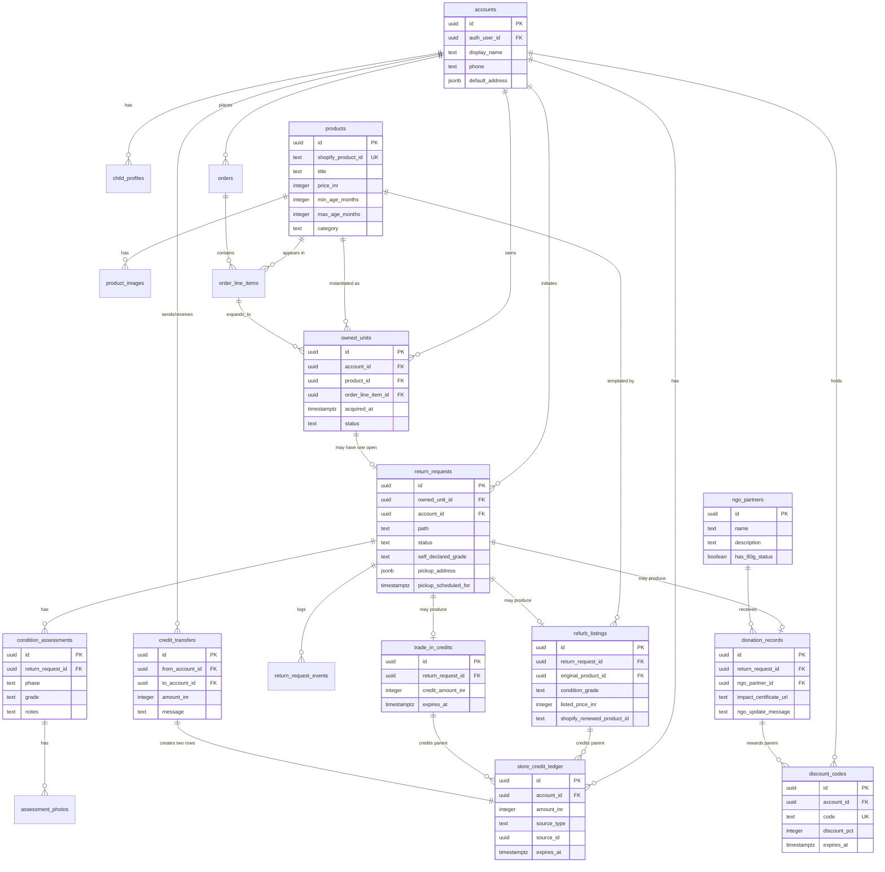

# ER Diagram

Renders in any GitHub markdown viewer or Mermaid live editor.



## State machine (return_requests.status)

```mermaid
stateDiagram-v2
    [*] --> draft : parent starts
    draft --> submitted : parent confirms path + pickup
    submitted --> pickup_scheduled : courier slot booked
    pickup_scheduled --> in_transit : courier picks up (QR scan)
    in_transit --> received : warehouse receiving
    received --> qc_passed : ops confirms self-declared grade
    received --> qc_downgraded : ops downgrades, parent must accept
    received --> qc_failed : unfit; recycle or return-to-sender
    qc_downgraded --> qc_passed : parent accepts new terms
    qc_downgraded --> cancelled : parent rejects
    qc_passed --> completed : credit issued / listing created / donation logged
    qc_failed --> completed : recycle path
    submitted --> cancelled : parent cancels
    pickup_scheduled --> cancelled : parent cancels
```
